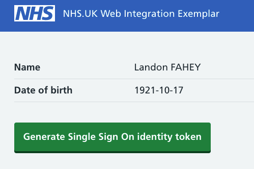

# nhs-app-sample-web-integration

## Introduction

The [NHS App web integration onboarding process](https://nhsconnect.github.io/nhsapp-developer-documentation/web-integration-overview/) requires an application that is:
- Onboarded with NHS Login
- NHS Login SSO compatible
- Able to handle "jump offs" from the NHS App in a defined format
- Behaves as outlined within the NHS App native application
- And optionally utilise the native app functionality available through [the NHS App JS API](https://nhsconnect.github.io/nhsapp-developer-documentation/js-api-specification/)

This simplified [ASP.NET](https://dotnet.microsoft.com/en-us/apps/aspnet) application is an example implementation of a service that could onboard onto the NHS App as a web integration.

## Overview

### Requirements

+ [Node v12.x.x (LTS)](https://nodejs.org/en/)
+ [NET 5 SDK](https://dotnet.microsoft.com/download)

### ASP .NET Core web application
- ASP .NET Core MVC Views using .NET 5 Framework
- NHS.UK frontend library

The application runs on Windows and Linux.

Locally the application will run on `https://localhost:8443`, which can be configured in `launchSettings.json`.

 [More information about the web app can be found here](WebApp.md)

## Configuration Settings
As part of the onboarding process with NHS Login, you will have been given a client id, a signing key and password.

These properties can **either**  be used to populate the following fields in  `appsettings.json`,

```js
"Auth": {
  "SigningKey": "<PATH_TO_SIGNING_KEY>",
  "SigningPassword": "<SIGNING_PASSWORD>"
},
"NhsLogin": {
  "ClientId": "<CLIENT_ID>",
},
```

**or** as secrets by running the following commands in the `/src/nhsapp.sample.web.integration` directory:

```bash
dotnet user-secrets set "Auth:SigningKey" "<PATH_TO_SIGNING_KEY>"
dotnet user-secrets set "Auth:SigningPassword" "<SIGNING_PASSWORD>"
dotnet user-secrets set "NhsLogin:ClientId" "<CLIENT_ID>"
```

You should now be able to run the app using Visual Studio/Rider, or through the CLI (run this from src/nhsapp.sample.web.integration).

```bash
dotnet build
dotnet run
```

## Docker and local dev

### Secrets

Docker uses a file per secret convention. You'll need to create a file for each secret.

Open docker-compose.dev.yml. Update the following secrets to where your signing key and password file are located:

```yaml
secrets:
  auth_signing_private_key:
    file: "~/example/secrets/auth_signing_private_key.pem"
  auth_signing_password:
    file: "~/example/secrets/text_file_containing_your_auth_signing_password.txt"
```

Set `NhsLogin__ClientId` to your client id.

### Local dev certificate

You'll need to generate a local dev certificate and give it a password. The command you need to run differs slightly depending on your OS platform. The -ep parameter in the command below is the path where your certificate will be created.

Windows using Linux containers

```bash
dotnet dev-certs https -ep %USERPROFILE%\.aspnet\https\base-application.pfx -p <password here>
dotnet dev-certs https --trust
```

macOS or Linux

```bash
dotnet dev-certs https -ep ${HOME}/.aspnet/https/nhsuk.base-application.pfx -p <password here>
dotnet dev-certs https --trust
```

These commands are lifted and edited from the broader documention here:

<https://github.com/dotnet/dotnet-docker/blob/main/samples/run-aspnetcore-https-development.md>

### Update the path and password to your certificate

The docker container has been setup to share the folder where your certificate was generated as `/https` on the container (see the volumes section of the `docker-compose.dev.yml` file) so that the container can see the local dev certificate you generated.

Update the following configuration values in `docker-compose.dev.yml` so the path to your certificate and its password are correct.

```yaml
ASPNETCORE_Kestrel__Certificates__Default__Path=<path>
ASPNETCORE_Kestrel__Certificates__Default__Password=<password>
```

Check the `volumes` section in `docker-compose.dev.yml`. There are two variations depending on your OS platform which are clearly marked. Remove or comment the one which isn't needed.

### Building and running

```bash
docker-compose build
docker-compose -f docker-compose.yml -f docker-compose.dev.yml up
```

The app should be accessible at <https://localhost:8443>.

## Logging Into the App

Once the app is running, you should see the logged out home page with two buttons to allow you to login via the following options:

+ Username / Password Login
+ Single Sign On (SSO) Login

### Username / Password Login

Choose the `Continue with NHS Login` button to complete the basic login.  This will take you to the configured NHS Login environment
(defaulted to sandpit at the moment) where you can provide a username (email address) and a password. After entering these details,
the NHS Login `authorize` journey begins.

Assuming that the details entered are valid, NHS Login will return the user to the endpoint configured in the `WebConfig:AuthorizeReturnPath`
property of `appsettings.json`

Please note that this return URL will have to be whitelisted with NHS Login before the journey can complete correctly.

### Single Sign On (SSO) Login

If the user already has a SSO token, then the token can be pasted into the **Single Sign On** text field in the
**Logged out home page**

As with a regular login request, a HTTP Request is sent to NHS Login's `authorize` endpoint, but this time with an extra query parameter
named `assertedLoginIdenity.`  An example of the URL that gets constructed is shown below:

```
    http://auth.ext.signin.nhs.uk/authorize?state=A
        &response_type=code
        &client_id=nhs-online
        &scope=openid profile profile_extended gp_registration_details email
        &vtr=["P5.Cp.Cd", "P5.Cp.Ck", "P5.Cm", "P9.Cp.Cd", "P9.Cp.Ck", "P9.Cm"]
        &redirect_uri=https://localhost:8443/auth-return
        &asserted_login_identity=<MY SSO TOKEN>
```

If the user does not have a SSO token, the user can log in using the conventional username/password method and once logged in
and on the profile page, can press the `Generate Single Sign On idenity token` button, copy the generated token, return
to the login page, paste it into the text box and choose to login with SSO.



## Error Handling

### Errors from NHS Login

In the event NHS Login can authorize the user but there was an error facilitating the request, the configured `return_uri`
will be redirected to with additional query pramaters indicating why the login request could not be fulfilled.

For example - the user has not accepted NHS Login's Terms & Conditions:

`https://localhost:8443/auth-return?error=access_denied&error_description=ConsentNotGiven&state=A`

### invalid_redirect_uri error

You click continue to NHS Login and receive the following error:
`{"error": "invalid_redirect_uri", "state": "A"}`

When you initiate a redirect to NHS Login to allow the user to sign in, the redirect_uri you pass must be whitelisted by NHS Login. For default dev, the passed redirect_uri is <https://localhost:8443/auth-return>.
