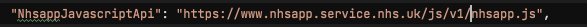
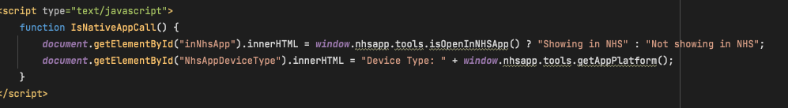

# Web App

### Build
Building the web application will automatically run `npm install && npm run build`. An incremental build is used so that these commands are only run if relevant files are modified, e.g. `main.scss` is modified.
The commands can be forced to run by a Rebuild in Visual Studio or running `dotnet --no-incremental` if using the CLI.

The `npm install` command installs all NPM dependencies listed within the `package.json`.

The `npm run build` command runs the `gulp build` task.

### Gulp
The application contains 2 tasks in `gulpfile.js`.

The task `build` will build CSS and JS assets and copy the images to `wwwroot/dist/images`. _These files are not commited to the repository._

The task `default` does the same as gulp build but adds a watch to recompile assets as they change in `wwwroot/src/**/*`.

### SCSS
A single SCSS file exists at `wwwroot/src/scss/main.scss`.

This file imports the required SCSS from NHS.UK frontend library.

Any custom SCSS can be added or imported into this file.

The Gulp tasks compile this file into CSS and minify it for production.

The resulting JavaScript is saved in `wwwroot/dist/main.css`. _This file is not commited to the repository_.

### JavaScript
A single JavaScript file exists at `wwwroot/src/js/main.js`.

This file imports the required JavaScript from NHS.UK frontend library.

Any custom ES2015 JavaScript can be added or imported into this file.

The Gulp tasks transpile this file into ES5 JavaScript using Babel and minify it for production. The resulting JavaScript is saved in `wwwroot/dist/main.js`. _This file is not commited to the repository_.

### Adobe analytics
Adobe analytics script is loaded in based on `AdobeAnalyticsScriptUrl` set in `appsettings.json`.

Adobe analytics `digitalData` object is built dynamically from application URL.

### Cookie banner
NHS.UK cookier banner is loaded in based on `CookieScriptUrl` set in `appsettings.json`.

### Nhsapp Javascript API

This will allow you to test interactions with the NHS App. For example navigating a user to specific pages within the NHS App or opening a page in a browser overlay.  

Once the app is running and you see the logged out homepage, you should see an additional link for the `Nhsapp API`. From here you should be able to select a feature allowing you to test interactions between your website and the NHS App.

The Javascript API itself is imported from the NHS App website `https://www.nhsapp.service.nhs.uk/` as seen below in `appsettings.json`

The code for each `cshtml` page should provide you with an example of how to use each feature. Since the NHS App Javascript API script has been imported in the layout page, we can just reference the API functions throughout the app.

For further information see [Javascript API Specification](https://nhsconnect.github.io/nhsapp-developer-documentation/js-api-specification/)